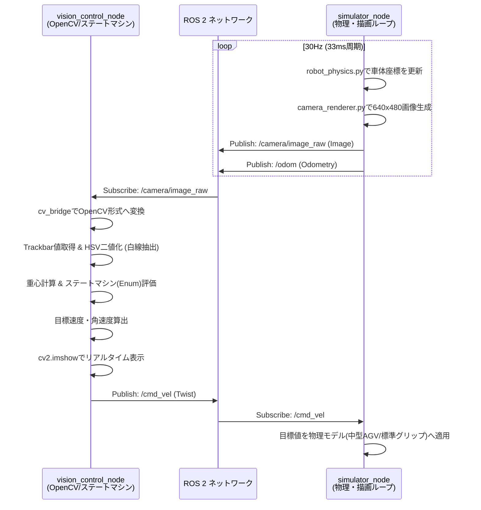

# ARCH_TITLE: hirakata_vision_simulation

## 1. システム概要と決定された採用技術

本システムは、差動二輪モデル（中型AGV想定）を用いたビジョンベースの自動走行アルゴリズムを検証するためのROS 2準拠の3Dシミュレーション環境です。「画像認識のための白線エッジの鮮明さ」と「物理挙動の安定性」を両立した環境を提供し、初期のアルゴリズム開発サイクルを最速化します。

**【採用技術と決定事項】**
*   **プラットフォーム**: ROS 2 (Pythonパッケージ)
*   **起動方式**: 独立起動方式（シミュレータと制御スクリプトを個別に起動）
*   **3D空間仕様**: 同一平面でのメッシュ分割（段差ゼロ）。環境光・影・ノイズなし。画面上部の遠景は単色塗りつぶし。
*   **コース仕様**: 直線5m×2、10m×2、コーナーR2.5mの横長角丸長方形。床色 RGB(177, 170, 164)。白線幅 5cm。
*   **移動体（ロボット）**: 中型AGV想定（トレッド幅 50〜60cm）。標準グリップ（実機相当の微小なスリップ発生）。
*   **初期配置**: 5m直線（L1）の中央、反時計回り方向。
*   **カメラ仕様**: 水平前方モデル（俯角0度・広角FOV）。設置高さ40cm。解像度 640x480。30 FPS。
*   **通信インターフェース**: トピック構成 `/camera/image_raw`, `/cmd_vel`, `/odom`
*   **制御スクリプト仕様**: Python + OpenCVベース。HSV色域抽出による白線二値化とGUIスライダー（Trackbar）を搭載。ピュアPython実装（`Enum` + `if-elif`）によるステートマシン構成。RViz2は今回は使用しない。

---

## 2. フォルダ・ファイル配置案（既存構成への差分）

既存の `src/hirakata_simulation/` フォルダをROS 2 Pythonパッケージとして構築します。ベースとなる物理・描画ロジックは既存の `simulation` フォルダの設計思想を踏襲しつつ、ROS 2ノードとしてカプセル化します。

```text
📁 src/
  📁 hirakata_simulation/            ← (新規構築するパッケージ)
    📄 package.xml                   ← ROS 2パッケージ定義
    📄 setup.py                      ← インストール設定、エントリポイント定義
    📄 setup.cfg
    📁 hirakata_simulation/          ← パッケージソースディレクトリ
      📄 __init__.py
      📄 simulator_node.py           ← シミュレータ本体ノード
      📄 vision_control_node.py      ← 制御用・GUI表示ノード（社長への納品物）
      📄 course_generator.py         ← 段差ゼロメッシュコース生成モジュール
      📄 robot_physics.py            ← 車体物理（標準グリップ）計算モジュール
      📄 camera_renderer.py          ← 3D描画・画像生成モジュール
    📁 launch/
      📄 simulator.launch.py         ← (オプション) シミュレータ単体起動用
```

---

## 3. 各ファイルの役割と必要な実装仕様

### `package.xml` / `setup.py`
*   **役割**: ROS 2パッケージ設定ファイル。
*   **実装仕様**:
    *   依存関係: `rclpy`, `sensor_msgs`, `geometry_msgs`, `nav_msgs`, `cv_bridge` を追加。
    *   `console_scripts` (エントリポイント) として `simulator_node` と `vision_control_node` を定義する。

### `hirakata_simulation/simulator_node.py`
*   **役割**: 仮想空間を構築し、ロボットの物理計算と描画ループを管理するメインシミュレータノード。
*   **実装仕様**:
    *   **Subscribe**: `/cmd_vel` (`geometry_msgs/Twist`)
    *   **Publish**: `/camera/image_raw` (`sensor_msgs/Image`), `/odom` (`nav_msgs/Odometry`)
    *   **タイマー処理**: 30Hz（33ms周期）で物理更新と画像レンダリングのループを実行。
    *   初期起動時、ロボットのスポーン位置をL1（5m直線）の中心座標に計算し、反時計回りに向くようにYaw角を設定。

### `hirakata_simulation/course_generator.py`
*   **役割**: 指定寸法のコース3Dメッシュデータ（頂点・インデックス）を生成する。
*   **実装仕様**:
    *   床面色（RGB 177, 170, 164）と白線色（RGB 255, 255, 255）を持つ同一平面上の2Dポリゴン群を生成する（Z方向の段差ゼロ）。
    *   白線幅は5cm。コーナー（R2.5m）部分は適切な分割数で曲線を表現する。

### `hirakata_simulation/camera_renderer.py`
*   **役割**: コースとロボットの情報を元に、カメラ視点の画像を生成する。
*   **実装仕様**:
    *   ロボットの原点から Z=+0.4m（高さ40cm）、Pitch=0（水平前方）の位置にカメラを配置。
    *   広角FOV（例: 90〜120度）の投影行列を設定し、解像度 640x480 でレンダリング。
    *   ライティング（陰影・スペキュラ）は無効（Unlit）とし、色はメッシュのベースカラーをそのまま出力する。
    *   遠景（Skybox）は描画せず、クリアカラーを単色（暗色系）に設定して画面上部を塗りつぶす。

### `hirakata_simulation/robot_physics.py`
*   **役割**: 中型AGV（トレッド幅 50〜60cm）の差動二輪運動学と摩擦・スリップを計算。
*   **実装仕様**:
    *   `/cmd_vel` で受け取った並進・旋回速度に対し、「標準グリップ」をシミュレートするための一次遅れ（慣性）や微小なスリップ（横滑り角の計算など）を組み込み、状態（X, Y, Yaw）を更新する。

### `hirakata_simulation/vision_control_node.py`
*   **役割**: 社長がアルゴリズム開発を行うための雛形スクリプト兼操作UI。
*   **実装仕様**:
    *   **ステートマシン**: `Enum`（例: `SEARCHING`, `FOLLOWING`, `LOST`）と `if-elif` によるピュアPython実装。
    *   **GUI（OpenCV）**: `cv2.imshow` で映像を表示。ウィンドウ内に `cv2.createTrackbar` を用いて、HSVの下限・上限を設定するスライダーを6つ配置。
    *   **画像処理パイプライン**:
        1. `/camera/image_raw` を `cv_bridge` でCV画像に変換。
        2. HSV色空間へ変換。
        3. Trackbarの現在値を用いて `cv2.inRange` で二値化マスクを作成。
        4. マスクの重心位置などを計算。
    *   **制御出力**: ステートに基づいて計算された目標速度・角速度を `/cmd_vel` にPublishする。

---

## 4. データ・制御の処理フロー



**【開発時の実行手順】**
1. ターミナル1で `ros2 run hirakata_simulation simulator_node` を起動し、バックグラウンドで空間を稼働させ続ける。
2. ターミナル2で `ros2 run hirakata_simulation vision_control_node` を実行する。
3. OpenCVのウィンドウが立ち上がり、スライダーで二値化の閾値を調整しながら、状態遷移（直進・旋回など）の開発・検証を行う。修正が必要な場合は、ターミナル2のスクリプトのみを停止・再実行する。